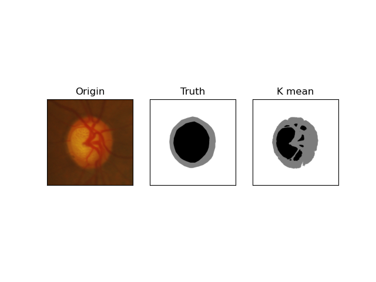
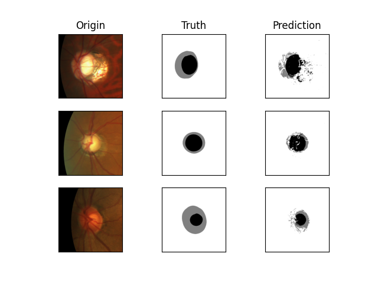
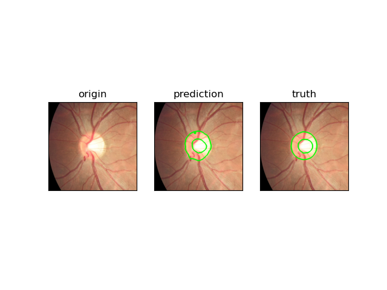

# 眼底图像分割中域泛化问题研究-机器学习作业

# 工作
- 传统机器学习方法
   - K均值聚类算法
      - 一种居于区域的无监督算法。通过对原始图像的像素点的亮度值对视盘、视杯进行分割，可通过调整聚类数量来提取视盘、视杯的分割效果。
   - 随机森林算法
      - 将图像分割任务转化为像素点分类任务。通过对原始图像进行边缘特征提取得到图像的边缘特征，随后联合图像的亮度信息喂入模型进行训练。
- 深度学习方法
   - FedSVG算法
      - 本算法修改自FedDG算法的实现。
   - FedDG算法
      -  本算法的官方实现只提供了算法框架，缺少数据处理代码，因此在这里对其进行补全。

# 效果
- K均值聚类算法

- 随机森林算法

- FedDG算法

# 后续改进工作
- 目前FedDG算法中连续频率空间插值可以看到明显的效果提升，但原论文中的边界损失函数的效果在实验过程中并没有得到良好的体现，因此后续将继续研究边界损失函数问题。
- 论文中所采用的元学习框架为训练过程带来更高的计算代价，下一步将探究将插值数据直接用于模型训练带来的泛化性能差异。

# 参考
本仓库FedDG算法参考自论文的开源实现[FedDG](https://github.com/liuquande/FedDG-ELCFS)
